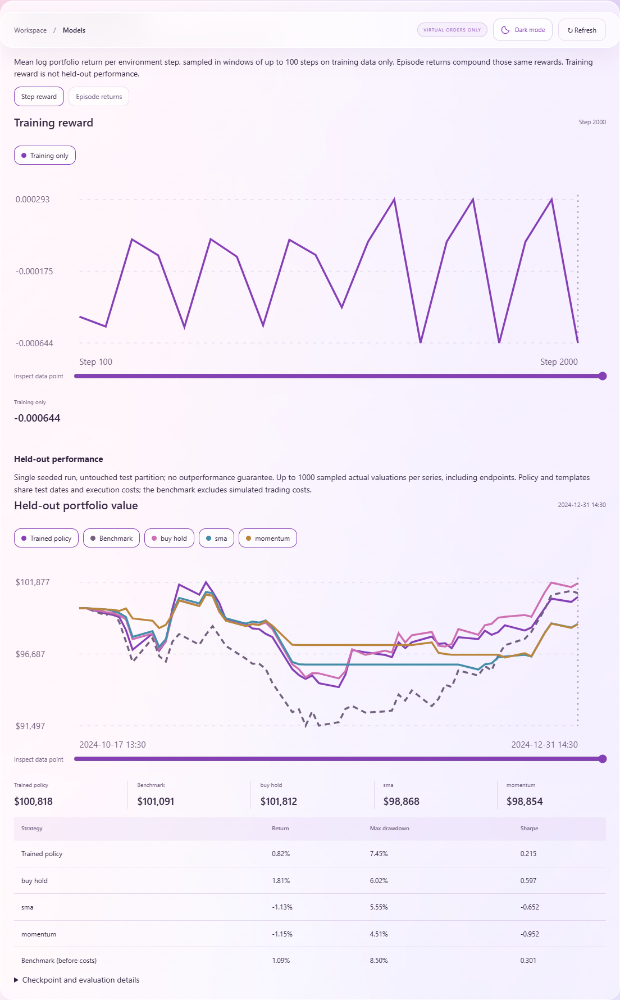

# Quantara

[](https://github.com/achitaan/Quantara/actions/workflows/ci.yml)

**A local-first platform for portfolio research, strategy simulation, and document-grounded AI explanations.**

Quantara brings portfolio accounting, quantitative analysis, historical backtesting, virtual paper trading, and model evaluation into one research workspace. The workflow starts with traceable data: test an investment idea, inspect its execution and results, then explain the recorded evidence.

I am developing Quantara to deepen my understanding of quantitative finance, machine learning, and full-stack engineering. The project emphasizes reproducible mechanics and transparent assumptions. An executable model is a starting point for evaluation, rather than a claim of investment performance.

## Research workflow

```text
Import portfolio and market data
             ↓
Analyze risk and optimize allocations
             ↓
Backtest a strategy and inspect its trades
             ↓
Replay or run a virtual paper account
             ↓
Evaluate forecasts, signals, tax research, and trained policies
             ↓
Ask the local assistant to explain the recorded results and sources
```



_Actual seeded DDPG training on synthetic research data. Learning rewards and held-out performance are displayed separately; the policy is compared with simple strategies and a benchmark._

## Capabilities

| Area                  | Implemented functionality                                                                                                                                                                      |
| --------------------- | ---------------------------------------------------------------------------------------------------------------------------------------------------------------------------------------------- |
| Portfolio accounting  | Persisted accounts, cash, holdings, transactions, watchlists, settings, and validated CSV imports                                                                                              |
| Market data           | Daily, one-minute, and five-minute data; exchange-calendar validation; corporate actions; provenance; Yahoo history and optional Alpaca feeds                                                  |
| Portfolio analytics   | Equal weight, maximum Sharpe, minimum volatility, risk parity, Black–Litterman, and CVaR optimization; VaR, expected shortfall, drawdown, benchmark-factor exposure, and stress scenarios      |
| Historical simulation | Shared accounting engine, next-bar execution, market/limit orders, trading costs, partial fills, chronological partitions, fixed-policy walk-forward evaluation, benchmarks, and trade exports |
| Paper trading         | Virtual account lifecycle, historical replay, forward bar polling, persisted orders/fills, duplicate protection, restart recovery, and stale-feed indicators                                   |
| Model research        | Gymnasium environment; seeded PPO/DDPG training; checkpoint verification; live reward/episode charts; held-out comparisons with buy-and-hold, SMA, and momentum                                |
| Signals and cash flow | Timestamped news/social imports and replay; local DistilBERT sentiment; chronological news-impact evaluation; recurring payments; baseline, Prophet, and LSTM forecasts                        |
| Canadian tax research | Pooled CAD adjusted cost base, transaction-date FX, account-type distinctions, provisional superficial-loss checks, harvesting proposals, and CSV exports                                      |
| Research assistant    | Local Qwen, validated analytical tools, streamed previews, persisted conversations, retrieval-augmented generation (RAG), document excerpts, and page citations                                |

Interactive charts support series toggles, portfolio-value/drawdown views, and pointer or keyboard inspection. Older checkpoints must be retrained to populate learning curves that were not originally recorded.

## Architecture

| Layer                     | Technology and responsibility                                                                                |
| ------------------------- | ------------------------------------------------------------------------------------------------------------ |
| Frontend                  | Next.js, React, and TypeScript; responsive glass-style light/dark interface and interactive charts           |
| API and research services | FastAPI, Pydantic, NumPy, pandas, and SciPy; calculations, accounting, execution, and validation             |
| Persistence               | SQLite for native single-process development; PostgreSQL for the configured team/container environment       |
| Background work           | Local worker executors, or Redis/Celery; job IDs, polling/SSE progress, retry, and cancellation              |
| Local language model      | Ollama with configurable Qwen; explanations and tool requests, while Python calculates numerical results     |
| Retrieval                 | Cached local MiniLM embeddings and FAISS; model/revision/index validation; lexical retrieval before indexing |
| Research models           | Stable-Baselines3/Gymnasium, DistilBERT, Prophet, and LSTM; separate from the language model                 |

The default AI configuration is **Ollama / `qwen3.5:4b`**. Local mode rejects cloud model tags and nonlocal Ollama hosts. There is no automatic hosted inference fallback, and calculations and simulations remain usable when the language model is unavailable.

## Learning goals and engineering decisions

Quantara is a way to study how financial models become testable software. The main learning areas are:

- **Accounting before prediction.** Reconcile cash, holdings, fees, splits, and dividends, and use one execution engine across backtesting, paper replay, and the RL environment.
- **Evaluation without future information.** Separate training, validation, and test history; enforce next-bar fills; verify that changing held-out prices does not change trained parameters.
- **Model comparison and reproducibility.** Record seeds, requested/actual training steps, execution costs, data fingerprints, and checkpoint checksums. Compare learned policies with simple baselines and report underperformance honestly.
- **Grounded local AI.** Keep financial calculations outside the language model, validate tool arguments, retrieve passages, check citation identifiers, and measure latency rather than assuming local inference is fast.
- **Application engineering.** Connect typed APIs, persistence, background jobs, authentication, streaming progress, and accessible visualization into a usable research workflow.
- **Verification through adversarial examples.** Check missing bars, infeasible optimization constraints, duplicate events, restart recovery, malformed model responses, and accounting consistency.

The [simulation and training audit](docs/RESEARCH_ACCURACY.md) records corrections and evaluation results. The [visualization and assistant report](docs/VISUALIZATION_AND_ASSISTANT.md) documents the subsequent usability and latency work. These reports distinguish tested software behavior from predictive accuracy.

## Getting started

### Native development

Prerequisites: **Python 3.12** and **Node.js 22**. From the repository root on Windows:

```powershell
py -3.12 -m venv .venv
.\.venv\Scripts\python.exe -m pip install -r backend\requirements.txt
Copy-Item backend\.env.example .env
.\.venv\Scripts\python.exe -m uvicorn app:app --app-dir backend --host 127.0.0.1 --port 8000
```

In a second terminal:

```powershell
cd frontend
npm ci
$env:BACKEND_URL = "http://127.0.0.1:8000"
npm run dev -- --port 3100
```

- Application: [http://127.0.0.1:3100](http://127.0.0.1:3100)
- API documentation: [http://127.0.0.1:8000/docs](http://127.0.0.1:8000/docs)
- Demo credentials: `demo` / `quantara-local-demo`

Select **Load research demo** to populate explicitly labeled synthetic history. Local data, downloaded weights, and checkpoints are stored under the ignored `runtime/` directory.

On Linux/macOS, use `python3.12` and `.venv/bin/python`, and set `BACKEND_URL=http://127.0.0.1:8000` when starting the frontend. Native SQLite/local jobs support one API process; use PostgreSQL/Celery for multiple processes.

### Local Qwen

The Windows setup script installs the pinned official Ollama release and verifies its published SHA-256 checksum. The service script disables Ollama cloud features.

```powershell
.\scripts\setup_ollama.ps1
.\scripts\serve_ollama.ps1
# In another terminal:
.\runtime\ollama\0.35.0\ollama.exe pull qwen3.5:4b
```

Alternatively, install [Ollama](https://ollama.com/download), configure `OLLAMA_NO_CLOUD=1` on the service, and run `ollama serve`.

| Setting           | Default                                  | Purpose                                  |
| ----------------- | ---------------------------------------- | ---------------------------------------- |
| `LLM_PROVIDER`    | `ollama`                                 | Local inference provider                 |
| `LLM_MODEL`       | `qwen3.5:4b`                             | Configurable model tag                   |
| `OLLAMA_URL`      | `http://127.0.0.1:11434`                 | Backend connection to Ollama             |
| `LLM_MAX_TOKENS`  | `600`                                    | Response-generation limit                |
| `LLM_KEEP_ALIVE`  | `30m`                                    | Model residency after inference requests |
| `EMBEDDING_MODEL` | `sentence-transformers/all-MiniLM-L6-v2` | Local document encoder                   |

The service uses an 8,192-token context, one parallel inference request, and a bounded prompt cache. Hardware and cold-loading time affect latency. Hosted inference is an explicit option requiring `LLM_PROVIDER=hosted`, an HTTPS `HOSTED_LLM_URL`, `HOSTED_LLM_KEY`, and a configured model; local mode does not switch to it automatically.

### Optional research models and document embeddings

Install the optional runtime for PPO/DDPG, sentiment, local embeddings/FAISS, Prophet, and LSTM:

```powershell
.\.venv\Scripts\python.exe -m pip install torch==2.8.0 --index-url https://download.pytorch.org/whl/cpu
.\.venv\Scripts\python.exe -m pip install -r backend\requirements-models.txt
$env:HF_HOME = Join-Path (Get-Location) "runtime/huggingface"
.\.venv\Scripts\python.exe scripts\cache_embedding_model.py
```

Embedding weights are downloaded explicitly once. Retrieval subsequently loads the cached encoder offline on CPU and reuses it. Other optional weights download on first use. Import documents in **Assistant**, then build/rebuild the local index. Text search works before indexing; stale or incompatible indexes are rejected with a rebuild message.

### Docker and team configuration

```sh
docker compose up --build
# Include the local AI service:
docker compose --profile ai up --build
docker compose exec ollama ollama pull qwen3.5:4b
```

Compose defines PostgreSQL, Redis, the API, Celery worker/scheduler, and the frontend at [http://127.0.0.1:3000](http://127.0.0.1:3000). Named volumes preserve database and runtime data. Set `INSTALL_MODELS=true` before rebuilding to include optional model dependencies. Initialize embedding weights in the shared runtime volume before indexing:

```sh
docker compose exec api python -c "from quantara.config import settings; from sentence_transformers import SentenceTransformer; SentenceTransformer(settings.embedding_model, device='cpu')"
```

For team use, configure `DEMO_MODE=false`, `TEAM_USERNAME`, `TEAM_PASSWORD`, and a nondefault `POSTGRES_PASSWORD`. Additional native users can be created with `scripts/team_user.py`. Passwords are hashed; sessions use HttpOnly cookies; ownership and request origins are checked. Configure `COOKIE_SECURE=true` and `ALLOWED_ORIGINS` for HTTPS.

Full Compose/Redis/Celery startup remains an environment acceptance item; native verification does not establish container deployment readiness.

## Demonstration and verification

With the API running:

```powershell
.\.venv\Scripts\python.exe scripts\demo.py --url http://127.0.0.1:8000
# Include forecasts, seeded training, and checkpoint backtests:
.\.venv\Scripts\python.exe scripts\demo.py --url http://127.0.0.1:8000 --include-models
# Measure Qwen tools, citations, latency, and residency:
.\.venv\Scripts\python.exe scripts\benchmark_ai.py --url http://127.0.0.1:8000
```

The latest recorded local verification includes **69 backend tests**, **five browser workflows**, additional real PPO/DDPG isolation/reproducibility checks, and cached embedding/FAISS verification. Nine optional/integration checks were skipped in the core run and are documented separately. Warm document answers on the tested machine took approximately **2–4 seconds**; analytical tool requests took **8–16 seconds**. These measurements are specific to the recorded hardware, prompts, and model state.

Run the core checks:

```powershell
.\.venv\Scripts\python.exe -m pytest
.\.venv\Scripts\python.exe -m ruff check backend\quantara backend\tests scripts
.\.venv\Scripts\python.exe scripts\export_openapi.py
cd frontend
npm run types
npm run typecheck
npm run build
npm run test:e2e
```

Enable optional neural checks after installing their dependencies and caching weights:

```powershell
# From the repository root:
$env:QUANTARA_MODEL_TESTS = "1"
$env:HF_HOME = Join-Path (Get-Location) "runtime/huggingface"
.\.venv\Scripts\python.exe -m pytest backend\tests\test_optional_models.py backend\tests\test_lightweight_models.py backend\tests\test_research_accuracy.py
cd frontend
npm run test:e2e
```

Browser tests use isolated ports 3101/8101 and Edge on Windows; Linux CI uses Chromium. Set `BROWSER_CHANNEL` for another installed browser. The policy-training browser workflow requires `QUANTARA_MODEL_TESTS=1`. `TEST_POSTGRES_URL` enables PostgreSQL integration checks. CI separates core/PostgreSQL/browser checks from the optional model runtime and caches embeddings before offline retrieval tests.

## Research boundaries

- Orders are virtual. Real brokerage execution, public onboarding, and general-purpose tax filing are outside the current scope.
- The simulator uses bar-based fill assumptions, costs, and volume participation. It does not model order-book queues or market impact; dividend, settlement, and withholding assumptions are documented in the audit.
- Chronological splits and reproducible seeds test evaluation mechanics. Short synthetic runs do not establish useful market predictions or trading outperformance.
- Canadian tax outputs are research calculations. Incomplete affiliated records, unfinished future windows, and complex overlapping transactions are marked provisional or require review.
- Language-model explanations require comparison with their recorded sources. Valid citation identifiers alone do not establish that every statement is correct.
- Live-provider integrations, prolonged forward-feed recovery, and the full container stack need further acceptance testing in the intended environment.

## Repository guide

| Path                | Contents                                                                        |
| ------------------- | ------------------------------------------------------------------------------- |
| `frontend/`         | Next.js interface, charts, typed client, and browser workflows                  |
| `backend/quantara/` | Supported API, accounting, analytics, simulation, retrieval, and model services |
| `backend/tests/`    | Numerical, accounting, API, ownership, recovery, and model-evaluation checks    |
| `scripts/`          | Setup, demonstrations, audits, API contracts, and benchmarks                    |
| `docs/`             | Data conventions, implementation status, verification, and research audits      |
| `legacy/`           | Preserved prototypes, excluded from the supported runtime                       |

Further reading: [data conventions](docs/DATA_CONVENTIONS.md), [implementation status](docs/IMPLEMENTATION.md), [verification history](docs/VERIFICATION.md), [research accuracy audit](docs/RESEARCH_ACCURACY.md), and [visualization/assistant verification](docs/VISUALIZATION_AND_ASSISTANT.md).
